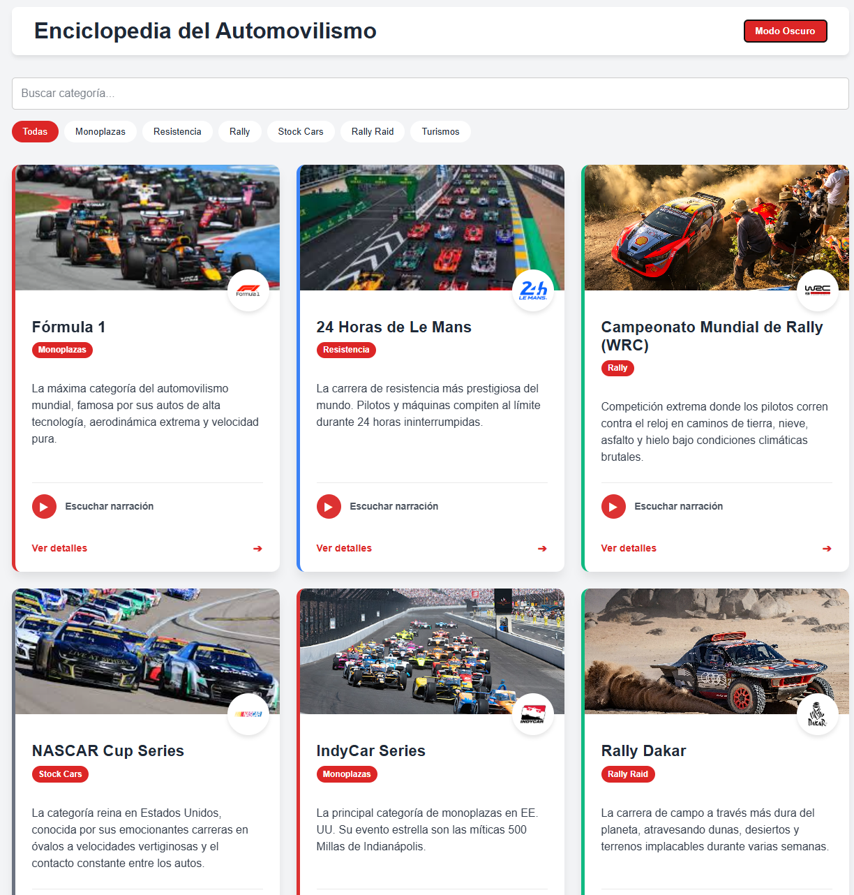
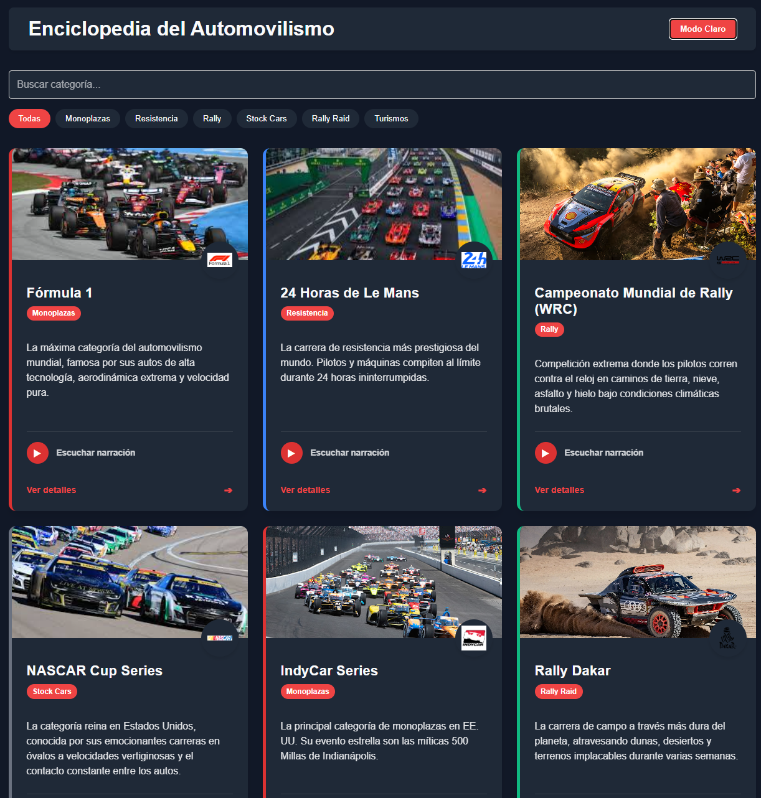
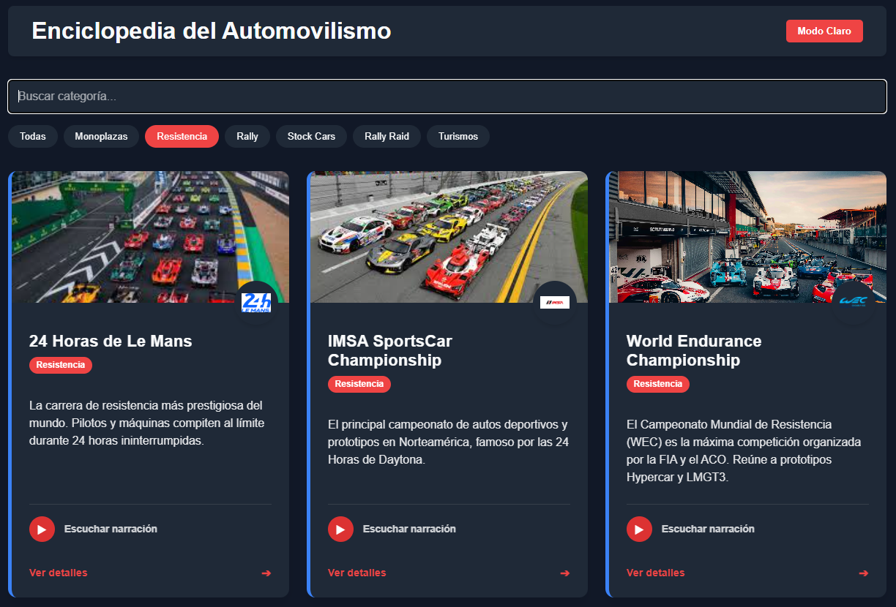
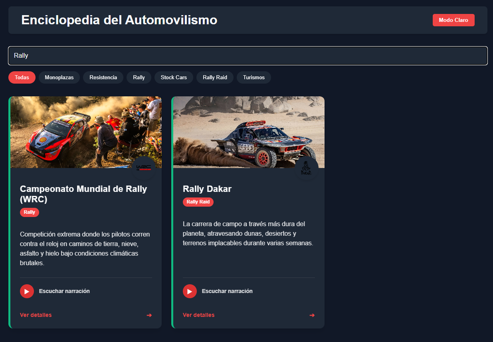
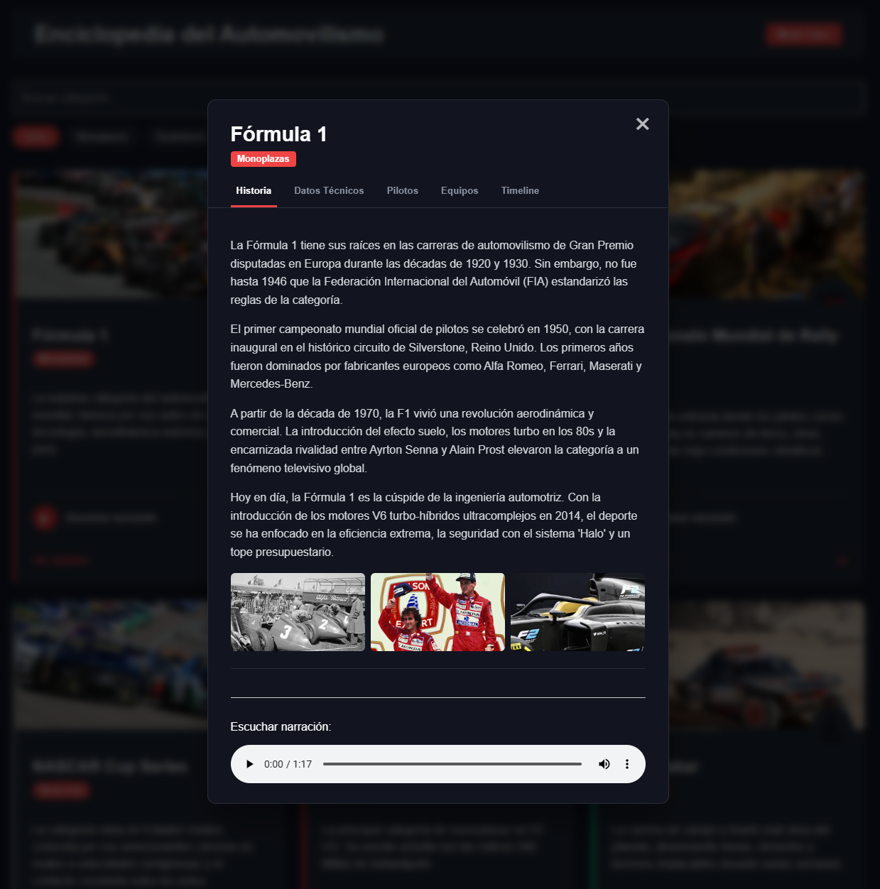
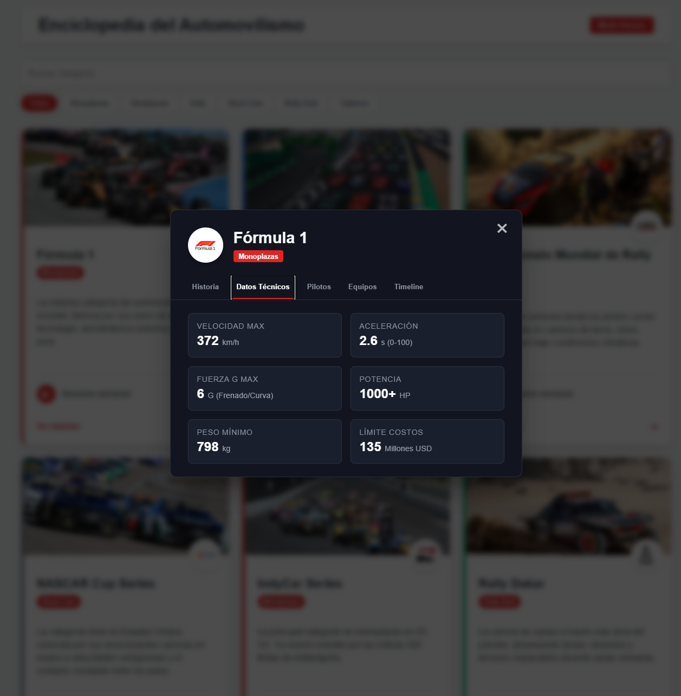
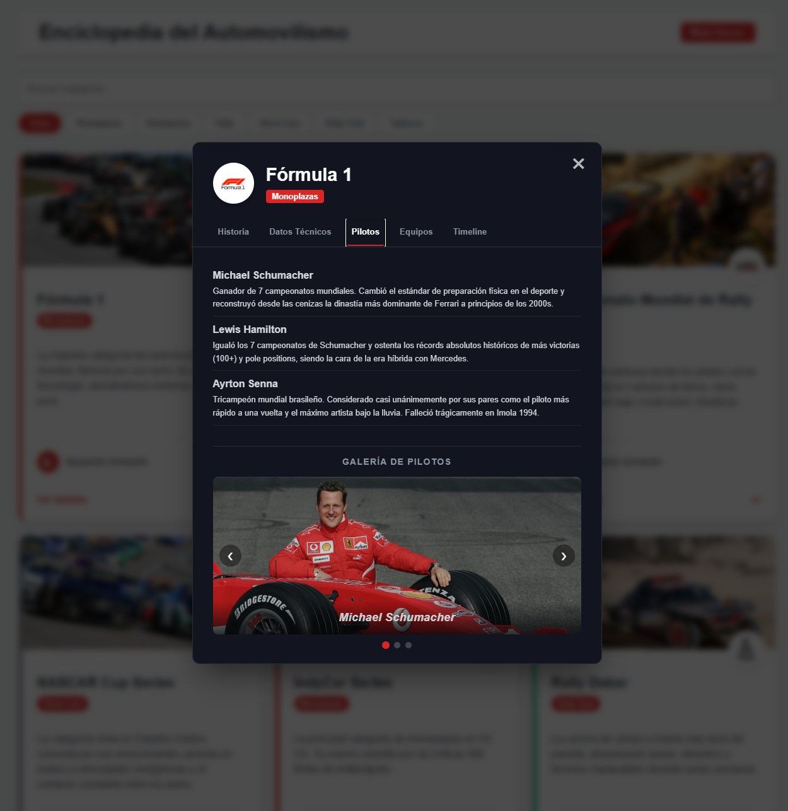
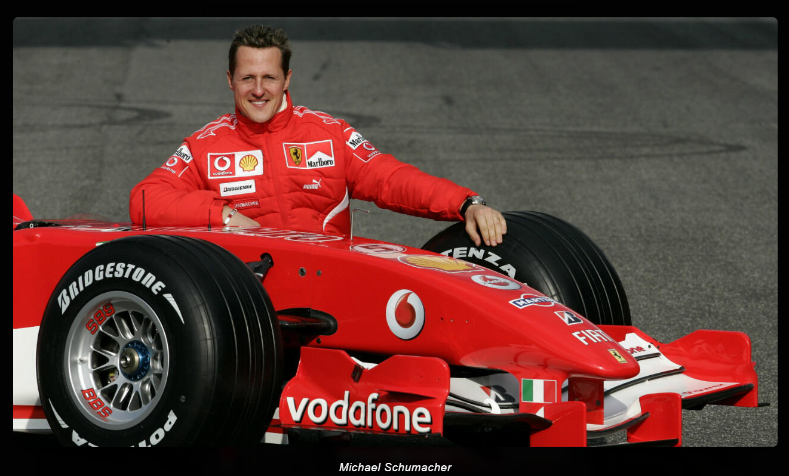
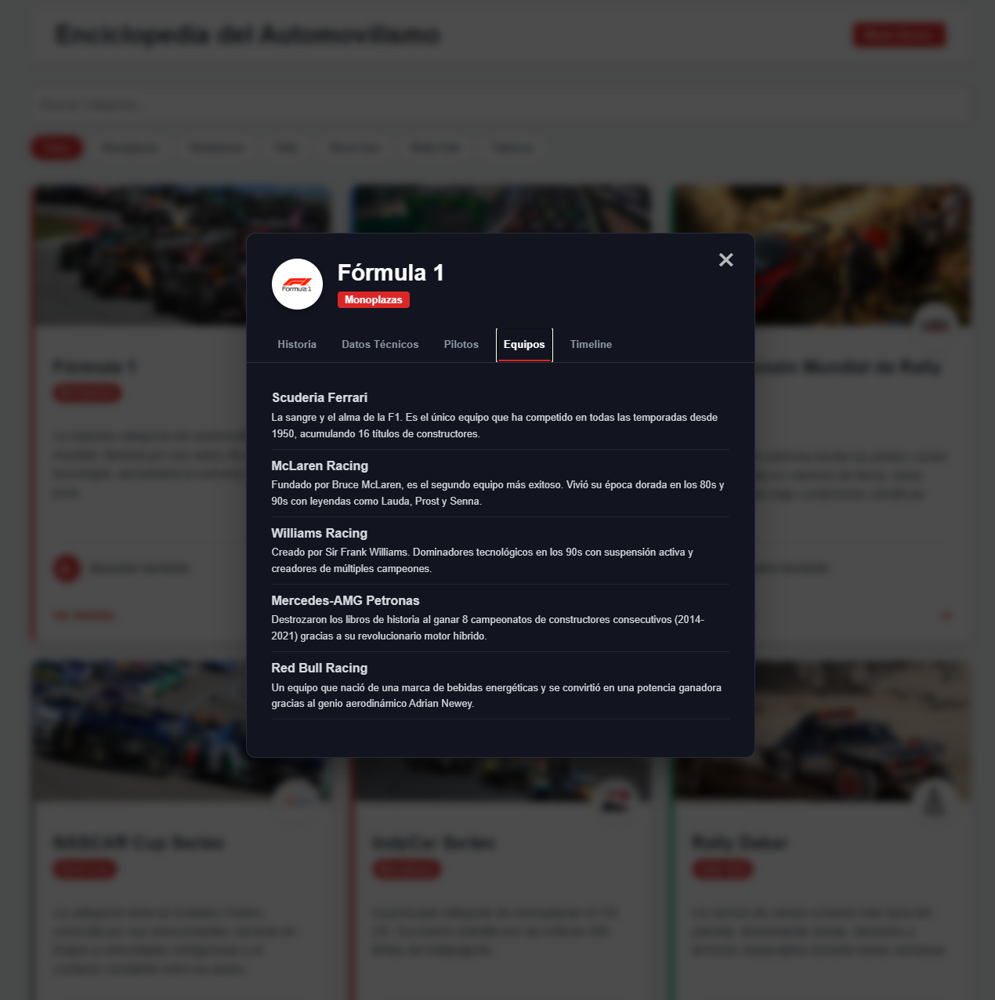
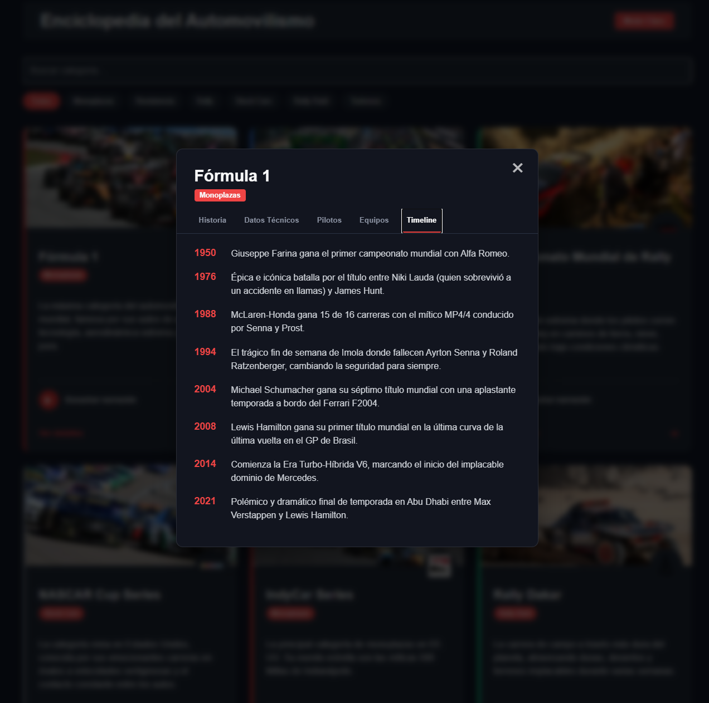

# Enciclopedia del Automovilismo

**Proyecto Personal - IF7102 Multimedios (Ciclo 2026)**
Sede Regional de Guanacaste, Recinto de Liberia - Universidad de Costa Rica.

Esta es una enciclopedia interactiva desarrollada como proyecto final para demostrar el aprendizaje autónomo de un framework JavaScript moderno. La aplicación permite explorar las categorías del automovilismo, filtrar por categorías, buscar en tiempo real y escuchar audios descriptivos.

## Tecnologías y Framework
* **Framework elegido:** Vue 3 (utilizando Composition API con `<script setup>`).
* **Herramienta de construcción:** Vite.
* **Gestor de paquetes:** pnpm.
* **Estilos:** CSS3 puro con variables nativas para el cambio de temas.

## Características Implementadas
* **Modularidad:** Separación lógica en 4 componentes (`HeaderSection`, `FilterControls`, `EntryCard`, `AudioPlayer`).
* **Reactividad:** Uso de `ref` y `computed` para el filtrado instantáneo en la barra de búsqueda y por botones de categoría.
* **Consumo de datos:** Carga asíncrona de la información desde un archivo estático `enciclopedia.json` mediante la API `fetch()` en el hook del ciclo de vida `onMounted`.
* **Tema Dinámico:** Soporte para cambiar entre Modo Claro y Modo Oscuro de forma fluida.

## Instrucciones de Ejecución

Sigue estos pasos para correr el proyecto localmente en tu computadora:

1. Clona este repositorio o descarga el código fuente.
2. Abre una terminal en la carpeta raíz del proyecto (`enciclopedia_proyectopersonal`).
3. Instala las dependencias necesarias ejecutando:
   \`\`\`bash
   pnpm install
   \`\`\`
4. Inicia el servidor de desarrollo local ejecutando:
   \`\`\`bash
   pnpm run dev
   \`\`\`
5. Abre en tu navegador la URL que indique la terminal (por defecto suele ser `http://localhost:5173/`).

## Capturas de Pantalla y Funcionalidades

AA continuación, se detalla el funcionamiento de los distintos módulos de la aplicación, evidenciando la reactividad y el diseño de la interfaz:

### 1. Sistema de Temas (Modo Claro / Oscuro)
La aplicación cuenta con un botón en el encabezado que permite alternar el tema visual de toda la página en tiempo real. Esto se logró mediante el uso de variables CSS dinámicas que ajustan el contraste de los fondos y textos para mejorar la accesibilidad y reducir la fatiga visual.

| Modo Claro | Modo Oscuro |
| :---: | :---: |
|  |  |

### 2. Motor de Búsqueda y Filtrado Reactivo
Aprovechando las propiedades computadas (`computed`) de Vue 3, la vista principal reacciona instantáneamente a las acciones del usuario sin necesidad de recargar la página. Se puede escribir en la barra para buscar coincidencias en los títulos o hacer clic en las "píldoras" de categorías para aislar disciplinas específicas.

| Filtrado por Categoría | Búsqueda por Texto |
| :---: | :---: |
|  |  |

### 3. Modal de Detalles: Pestaña "Historia" y Multimedia
Al hacer clic en "Ver detalles" en cualquier tarjeta, se despliega un modal superpuesto. La pestaña principal de **Historia** no solo carga párrafos de texto enriquecido, sino que integra dos elementos multimedia clave:
* **Audio de Narración:** Un reproductor nativo en la parte inferior que permite escuchar un resumen locutado de la historia de la categoría.
* **Galería Interactiva:** Una cuadrícula de imágenes en miniatura que responden al cursor (efecto hover).

### 4. Visor de Imágenes a Pantalla Completa (Lightbox)
Si el usuario hace clic en cualquiera de las imágenes dentro de la pestaña de **Historia** o en el carrusel interactivo de la pestaña de **Pilotos**, la aplicación bloquea el fondo y abre un componente tipo **Lightbox**. Esto permite ver la fotografía en alta resolución, oscureciendo el resto de la interfaz y mostrando la descripción de la imagen (`alt` text) en la parte inferior.

| Lightbox en Historia | Lightbox en Pilotos |
| :---: | :---: |
|  |  |

### 5. Pestaña "Datos Técnicos"
Una cuadrícula limpia (`CSS Grid`) que extrae del JSON las métricas más impresionantes de cada vehículo (Velocidad máxima, aceleración, fuerzas G, potencia, etc.), formateadas para una lectura rápida.

### 6. Pestaña "Pilotos" (Carrusel Interactivo)
Esta sección cuenta con un componente tipo *Slideshow*. Las imágenes de los pilotos cambian automáticamente mediante un temporizador, pero el usuario también puede tomar el control manual utilizando las flechas laterales (`❮` `❯`) o los indicadores de puntos inferiores. Además, al hacer clic sobre la fotografía de cualquier piloto, la imagen se expande gracias a la integración del Lightbox.

### 7. Pestaña "Equipos"
Una vista de lista estructurada para leer cómodamente la información histórica de las escuderías y marcas fabricantes más exitosas de cada competición, manteniendo el diseño minimalista.

### 8. Pestaña "Timeline" (Eventos Clave)
Una representación cronológica que recorre los hitos, tragedias, revoluciones tecnológicas y momentos deportivos que definieron el rumbo de cada categoría automovilística a lo largo de las décadas.

