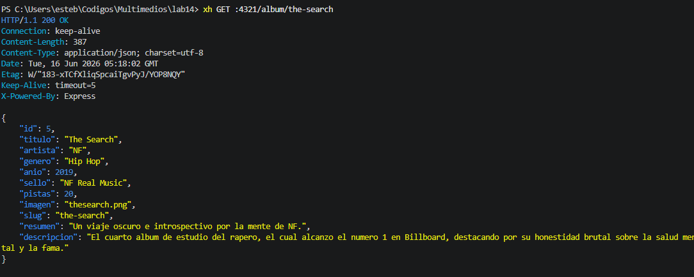
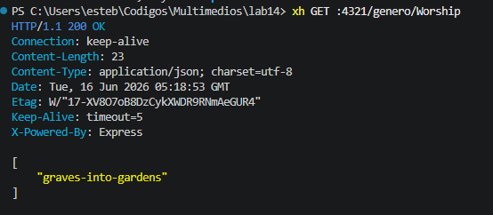
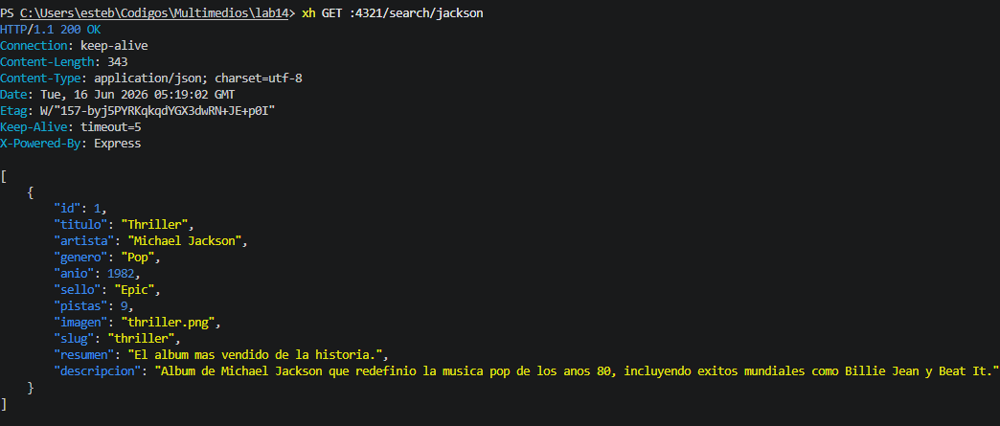
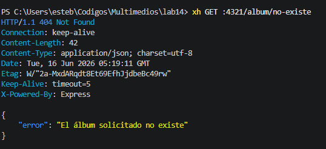
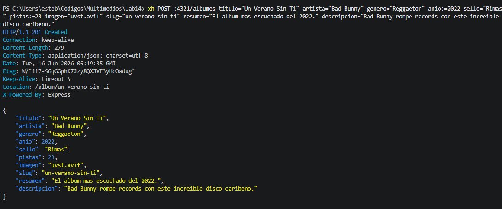
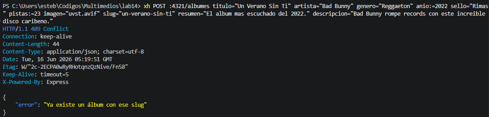
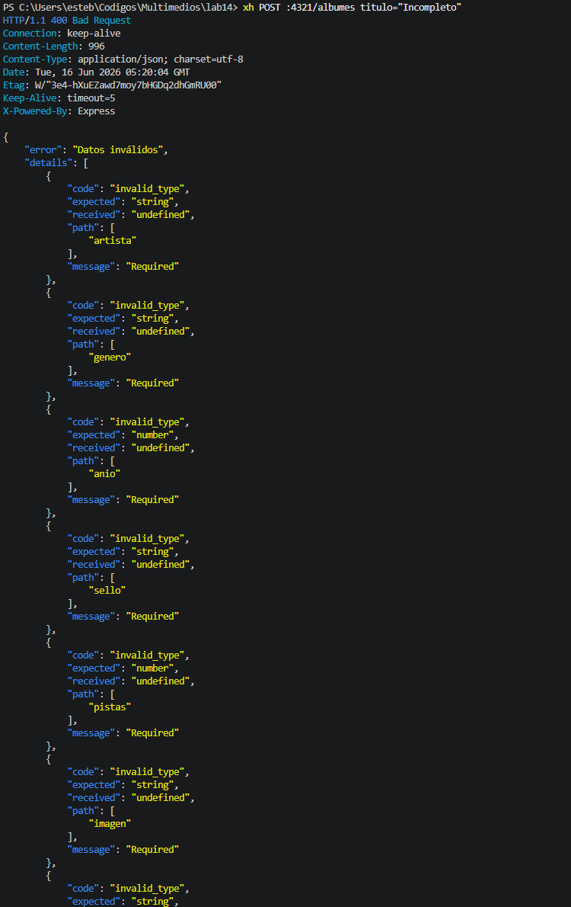
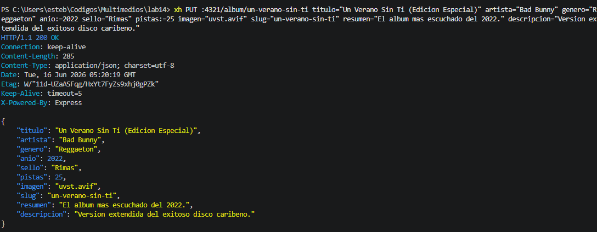
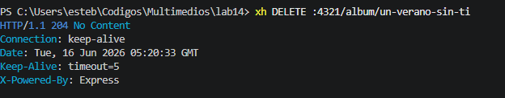

## Capturas de Pruebas (HTTPie / XH)

### 1. Operaciones de Lectura (GET)

**Obtener todos los álbumes (200 OK):**
`xh GET :4321/albumes`

**Obtener un álbum específico (200 OK):**
`xh GET :4321/album/the-search`

**Obtener álbumes por género (200 OK):**
`xh GET :4321/genero/Rock`

**Búsqueda por texto (200 OK):**
`xh GET :4321/search/jackson`

**Error al buscar álbum inexistente (404 Not Found):**
`xh GET :4321/album/no-existe`

---

### 2. Operaciones de Escritura (POST, PUT, DELETE)

**Crear un nuevo álbum (201 Created):**
`xh POST :4321/albumes titulo="Un Verano Sin Ti" artista="Bad Bunny" genero="Reggaeton" anio:=2022 sello="Rimas" pistas:=23 imagen="uvst.avif" slug="un-verano-sin-ti" resumen="El album mas escuchado del 2022." descripcion="Bad Bunny rompe records con este increible disco caribeno."`

**Error al crear un álbum con slug duplicado (409 Conflict):**
*(Se ejecuta exactamente el mismo comando de arriba por segunda vez)*
`xh POST :4321/albumes titulo="Un Verano Sin Ti" artista="Bad Bunny" genero="Reggaeton" anio:=2022 sello="Rimas" pistas:=23 imagen="uvst.avif" slug="un-verano-sin-ti" resumen="El album mas escuchado del 2022." descripcion="Bad Bunny rompe records con este increible disco caribeno."`

**Error de validación de Zod por datos incompletos (400 Bad Request):**
`xh POST :4321/albumes titulo="Incompleto"`

**Actualizar un álbum existente (200 OK):**
`xh PUT :4321/album/un-verano-sin-ti titulo="Un Verano Sin Ti (Edicion Especial)" artista="Bad Bunny" genero="Reggaeton" anio:=2022 sello="Rimas" pistas:=25 imagen="uvst.avif" slug="un-verano-sin-ti" resumen="El album mas escuchado del 2022." descripcion="Version extendida del exitoso disco caribeno."`

**Eliminar un álbum (204 No Content):**
`xh DELETE :4321/album/un-verano-sin-ti`

---

###Verificación de Imágenes Estáticas

Prueba de acceso a imágenes a través del navegador web demostrando el correcto funcionamiento de `express.static`:

* **Thriller (Michael Jackson):** [http://localhost:4321/imagenes/thriller.png](http://localhost:4321/imagenes/thriller.png)
* **The Search (NF):** [http://localhost:4321/imagenes/thesearch.png](http://localhost:4321/imagenes/thesearch.png)

