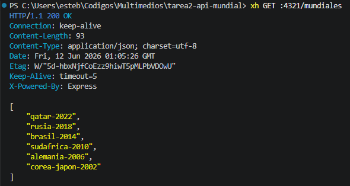
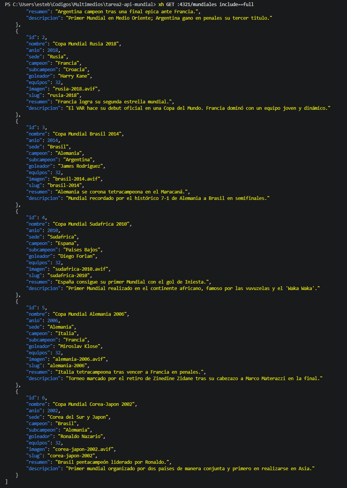
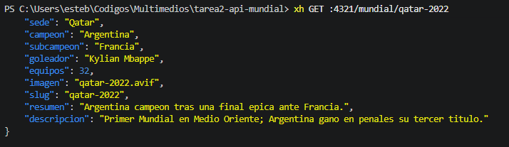
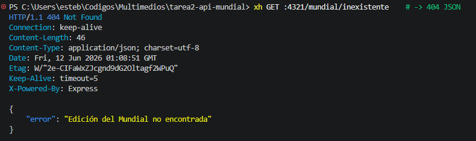
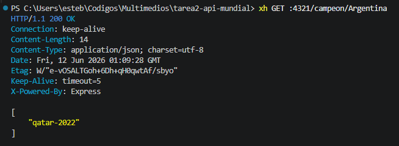
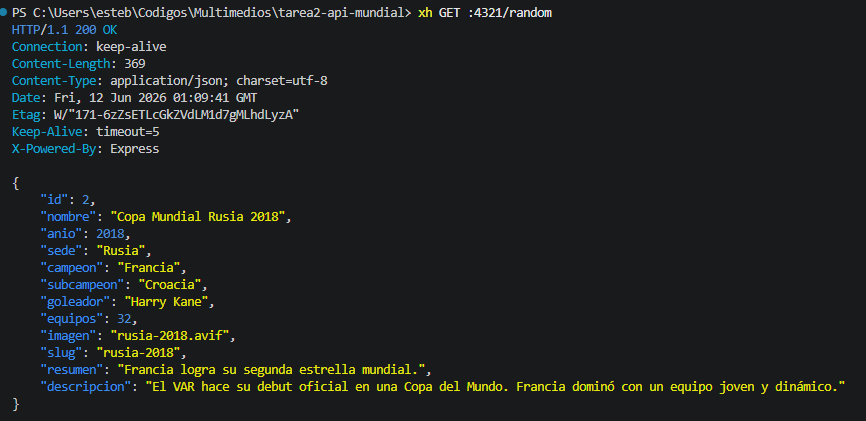
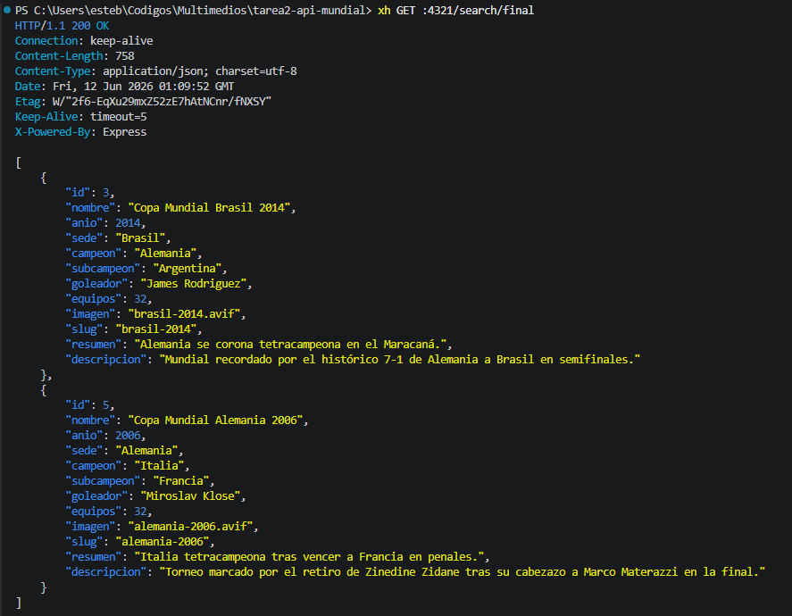
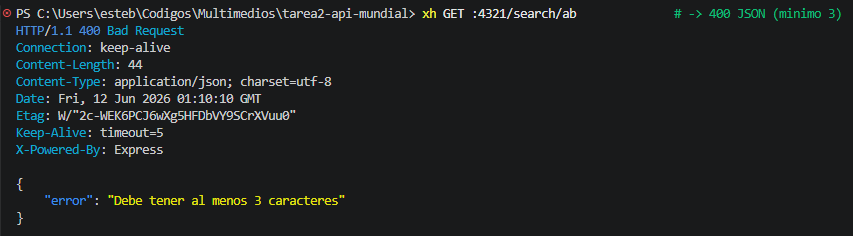

# API Copa Mundial de la FIFA 🏆

API REST desarrollada con Node.js, Express y SQLite que provee información sobre diversas ediciones de la Copa Mundial.

## ⚙️ Configuración y Ejecución

1. Instalar dependencias:
   \`\`\`bash
   pnpm install
   \`\`\`

2. Poblar la base de datos (SQLite):
   \`\`\`bash
   pnpm run db:create
   \`\`\`

3. Iniciar el servidor en modo desarrollo:
   \`\`\`bash
   pnpm run dev
   \`\`\`
   El servidor se iniciará en `http://localhost:4321`

## 📸 Capturas de Pruebas (HTTPie / XH)

1. `xh GET :4321/mundiales`
   
2. `xh GET :4321/mundiales include==full`
   
3. `xh GET :4321/mundial/qatar-2022`
   
4. `xh GET :4321/mundial/inexistente` (Debe devolver 404)
   
5. `xh GET :4321/campeon/Argentina`
   
6. `xh GET :4321/random`
   
7. `xh GET :4321/search/final`
   
8. `xh GET :4321/search/ab` (Debe devolver 400 JSON)
   